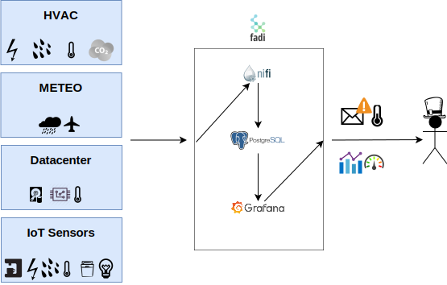

FADI User guide
=========

This page provides documentation on how to use the FADI big data framework.

A sample use case - Building monitoring at CETIC offices
---------------



In this simple example, we will ingest temperature measurements from sensors, store them and display them in a simple dashboard.

### 1. Install FADI

To install the FADI framework on your workstation or on a cloud, see the [installation instructions](https://github.com/cetic/fadi/INSTALL.md). 

The components needed for this use case are the following:

* Apache Nifi as a integration tool to ingest the sensor data from the data source (a csv file in this case) and store it in the database
* PostgreSQL as both a datawarehouse and datalake
* Gafana as a dashboard tool to display graphs from the data ingested and stored in the datalake

Those components are configured in the following [sample config file](heml/deploy.sh), once the platform is ready, you can start working with it:

### 2. Ingest and store measurements 

<a href="http://nifi.apache.org/" alt="Apache Nifi"></a>

> "An easy to use, powerful, and reliable system to process and distribute data."

[Apache Nifi](http://nifi.apache.org/) provides ingestion mechanism (to e.g. connect a database, REST API, csv files on a FTP, ... for ingestion): in this case we want to read the temperature sensors data from our HVAC system and store it in a database.

Temperature measurements from the last 5 days (see [HVAC sample temperatures csv extract](doc/usecases/basic/sample_data.csv)) are ingested:

```csv
(...)
23.5,1561467513.503
23.5,1561467543.504
23.5,1561467573.503
23.5,1561467603.504
23.5,1561467633.504
23.5,1561467663.503
23.5,1561467693.503
23,1561467723.504
23,1561467753.503
23,1561467783.504
23,1561467813.504
23,1561467843.503
23.5,1561467873.503
23.5,1561467903.504
23.5,1561467933.503
23.5,1561467963.503
23.5,1561467993.504
(...)
```

First, head to the Nifi web interface, if you are using the local installation with Minikube you can run the following command:

 ```
 minikube service fadi-nifi-load-balancer -n fadi
 ```


Now we need to tell Nifi to read the csv file and store the measurements in the data lake:


For more information on how to use Apache Nifi, see the [official Nifi user guide](https://nifi.apache.org/docs/nifi-docs/html/user-guide.html)

### 3. Display dashboards and configure alerts

Once the measurements are stored in the database, we will want to display the results in a dashboard.

Head to the Grafana interface: `minikube service grafana`


First we will define the datasource:


Then we will configure a simple dashboard that shows the temperatures over the last week:


And finally we will configure some alerts using very simple rules:


For more information on how to use Grafana, see the [official Grafana user guide](https://grafana.com/docs/guides/getting_started/)

### 4. Explore

Superset provides some interesting features to explore your data and build basic dashboards.

Head to the Superset interface: `minikube service superset`


First we will define the datasource:


Then we will explore our data and build a simple dashboard with the data that is inside the database:


For more information on how to use Superset, see the [official Superset user guide](https://superset.incubator.apache.org/tutorial.html)

### 5. Process

Jupyter notebooks provide an easy interface to the Spark processing engine that runs on your cluster.

In this simple use case, we will try to access the data that is stored in the data lake.

Head to the Jupyter notebook interface: `minikube service jupyterhub`


Do some processing in the notebook


For more information on how to use Superset, see the [official Jupyter documentation](https://jupyter.readthedocs.io/en/latest/)

### 6. Summary

In this use case, we have demonstrated a simple configuration for FADI, where we use various services to ingest, store, analyse, explore and provide dashboards and alerts 

You can find the various resources for this sample use case (nifi flowfile, grafana dashboards, ...) in the [doc/usecases/basic folder](doc/usecases/basic)